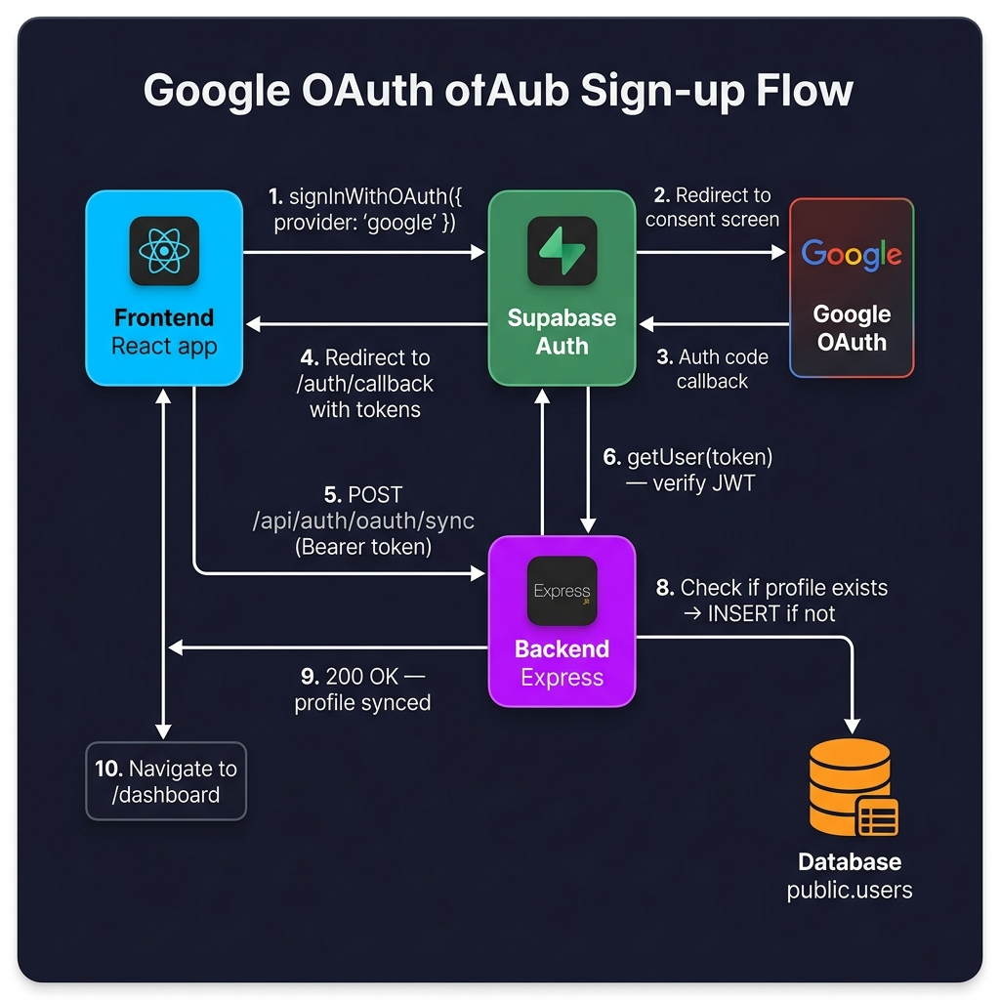
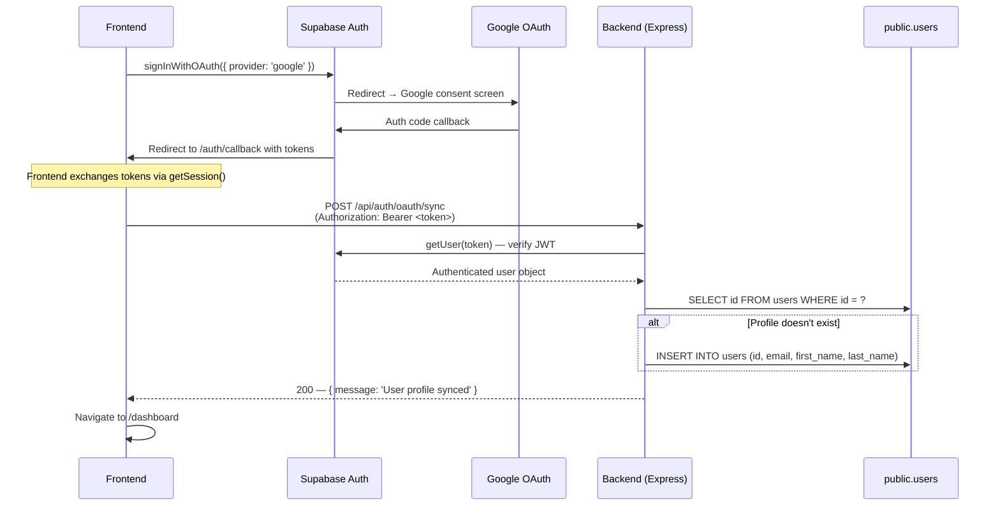

# Google OAuth — Backend Implementation Plan

## Background

Maven currently uses **email/password authentication** via Supabase Auth. The existing backend has a well-structured auth layer:

| File | Role |
|------|------|
| [auth.service.js](file:///home/batman/Desktop/Maven/backend/src/services/auth.service.js) | `signUp()`, `signIn()`, `signOut()`, password reset |
| [auth.controller.js](file:///home/batman/Desktop/Maven/backend/src/controllers/auth.controller.js) | Request handlers for each auth operation |
| [auth.routes.js](file:///home/batman/Desktop/Maven/backend/src/routes/auth.routes.js) | Route registration under `/api/auth/*` |
| [auth.middleware.js](file:///home/batman/Desktop/Maven/backend/src/middleware/auth.middleware.js) | `requireAuth` — JWT verification via `supabase.auth.getUser()` |
| [supabase.service.js](file:///home/batman/Desktop/Maven/backend/src/services/supabase.service.js) | `supabase` (anon) and `supabaseAdmin` (service role) clients |

### The Problem

When a user signs up via Google OAuth, the **OAuth redirect flow is handled entirely by Supabase + the frontend**. The backend's `signUp()` function (which manually inserts into `public.users`) is **never called**, leaving the user without a profile row.

The [auth_trigger.sql](file:///home/batman/Desktop/Maven/backend/auth_trigger.sql) database trigger exists to auto-create `public.users` rows, but it relies on `raw_user_meta_data->>'first_name'` and `'last_name'` fields — fields that **Google does not set** (Google provides `full_name`, `name`, and `avatar_url` instead).

---

## User Review Required

> [!IMPORTANT]
> **Google Cloud Console credentials are a prerequisite.** You need a Google OAuth 2.0 Client ID and Client Secret from [Google Cloud Console](https://console.cloud.google.com/apis/credentials). These get pasted into Supabase Dashboard → Authentication → Providers → Google.

> [!WARNING]
> **Account linking for duplicate emails.** If a user signs up with email/password and later clicks "Sign in with Google" using the same email, Supabase's behavior depends on the "Linking" setting:
> - **Auto-link** (recommended): Merges identities — same `auth.users` row, same `public.users` row.
> - **No linking**: Creates a separate identity — potential for duplicate/orphaned profiles.
>
> Verify this setting in **Supabase Dashboard → Auth → Settings → Account Linking**.

---

## Open Questions

1. **Do you already have Google OAuth credentials** (Client ID + Client Secret), or do you need a walkthrough for creating them?
2. **Account linking preference**: Auto-link Google + email identities sharing the same email? (Recommended: **yes**)
3. **`avatar_url` column**: Google provides a profile picture URL. Should we add an `avatar_url TEXT` column to `public.users` to store it? (Recommended: **yes** — useful for UI)
4. **Auth trigger**: The existing `handle_new_user()` trigger may fire for Google OAuth signups and fail silently (since `first_name`/`last_name` keys don't exist in Google's metadata). Should we update the trigger to be more resilient, or rely solely on the backend sync endpoint?

---

## Proposed Changes

### Prerequisite: Supabase + Google Cloud Console Setup (Manual)

This is a one-time configuration, **not code changes**.

**Google Cloud Console:**
1. Go to [APIs & Services → Credentials](https://console.cloud.google.com/apis/credentials)
2. Create an **OAuth 2.0 Client ID** (Web Application type)
3. Set **Authorized redirect URIs** to: `https://wsjeknzihzorovfyhhwm.supabase.co/auth/v1/callback`
4. Copy the generated **Client ID** and **Client Secret**

**Supabase Dashboard:**
1. Go to **Authentication → Providers → Google**
2. Toggle **Enable**
3. Paste the **Client ID** and **Client Secret**
4. Save

---

### Component 1: Auth Service — `syncOAuthUser()`

#### [MODIFY] [auth.service.js](file:///home/batman/Desktop/Maven/backend/src/services/auth.service.js)

Add a new `syncOAuthUser()` function that ensures a `public.users` row exists for OAuth-authenticated users. This is called **after** the frontend completes the Google OAuth redirect and obtains a valid session.

```javascript
/**
 * Ensure a public.users row exists for an OAuth-authenticated user.
 * Called by the frontend after Google OAuth redirect with a valid session token.
 *
 * @param {object} user - The Supabase auth user object (from requireAuth middleware)
 * @returns {object} The public.users profile row
 */
async function syncOAuthUser(user) {
  // 1. Check if profile already exists (idempotent)
  const { data: existing } = await supabaseAdmin
    .from('users')
    .select('id')
    .eq('id', user.id)
    .single();

  if (existing) {
    logger.info(`OAuth sync: Profile already exists for user ${user.id}`);
    return existing;
  }

  // 2. Extract name from Google metadata
  //    Google provides: full_name, name, avatar_url, email
  const meta = user.user_metadata || {};
  const nameParts = (meta.full_name || meta.name || '').split(' ');
  const firstName = nameParts[0] || '';
  const lastName = nameParts.slice(1).join(' ') || '';

  // 3. Insert new profile row
  const { data, error } = await supabaseAdmin.from('users').insert({
    id: user.id,
    email: user.email,
    first_name: firstName,
    last_name: lastName,
  }).select().single();

  if (error) {
    logger.error(`OAuth user sync failed for ${user.id}: ${error.message}`);
    throw new Error(`Failed to sync OAuth user profile: ${error.message}`);
  }

  logger.info(`OAuth sync: Created profile for user ${user.id} (${user.email})`);
  return data;
}
```

Export the new function:
```diff
 module.exports = {
   signUp,
   signIn,
   sendPasswordResetEmail,
   updatePassword,
-  signOut
+  signOut,
+  syncOAuthUser
 };
```

**Design decisions:**
- Uses `supabaseAdmin` (service role) to bypass RLS — the user doesn't have a `public.users` row yet, so RLS would block the insert.
- Idempotent — safe to call multiple times (checks for existing row first).
- Parses `full_name` into `first_name` / `last_name` since Google doesn't provide them separately.

---

### Component 2: Auth Controller — `handleOAuthSync`

#### [MODIFY] [auth.controller.js](file:///home/batman/Desktop/Maven/backend/src/controllers/auth.controller.js)

Add a new controller function:

```javascript
/**
 * POST /api/auth/oauth/sync
 *
 * Called by the frontend after a successful Google OAuth redirect.
 * The frontend sends the Supabase access token in the Authorization header,
 * and this endpoint ensures the user has a corresponding public.users row.
 */
async function handleOAuthSync(req, res) {
  try {
    // req.user is set by the requireAuth middleware (JWT verified)
    const user = req.user;
    const profile = await authService.syncOAuthUser(user);
    return res.status(200).json({ message: 'User profile synced', data: profile });
  } catch (error) {
    return res.status(400).json({ error: error.message });
  }
}
```

Export the new function:
```diff
 module.exports = {
   handleSignUp,
   handleLogin,
   handlePasswordResetRequest,
   handleUpdatePassword,
-  handleLogout
+  handleLogout,
+  handleOAuthSync
 };
```

---

### Component 3: Auth Routes — New Endpoint

#### [MODIFY] [auth.routes.js](file:///home/batman/Desktop/Maven/backend/src/routes/auth.routes.js)

Add the new protected route:

```diff
 // Protected endpoints
 router.post('/update-password', requireAuth, authController.handleUpdatePassword);
 router.post('/logout', requireAuth, authController.handleLogout);
+
+// OAuth profile sync (called after Google redirect)
+router.post('/oauth/sync', requireAuth, authController.handleOAuthSync);

 module.exports = router;
```

**New endpoint summary:**

| Method | Path | Auth | Purpose |
|--------|------|------|---------|
| `POST` | `/api/auth/oauth/sync` | `requireAuth` (Bearer token) | Ensures `public.users` row exists for OAuth users |

---

### Component 4: Database Migration (Optional)

#### `public.users` table — add `avatar_url` column

If you want to store the Google profile picture:

```sql
ALTER TABLE public.users ADD COLUMN IF NOT EXISTS avatar_url TEXT;
```

And update the `syncOAuthUser` insert to include:
```javascript
avatar_url: meta.avatar_url || null,
```

> [!NOTE]
> This is optional. If you don't need profile pictures from Google, skip this step entirely. The core OAuth flow works without it.

---

### Component 5: Auth Trigger Hardening (Optional)

#### [MODIFY] [auth_trigger.sql](file:///home/batman/Desktop/Maven/backend/auth_trigger.sql)

The existing trigger extracts `first_name` and `last_name` from `raw_user_meta_data`, but Google OAuth uses different keys (`full_name`, `name`). To make the trigger resilient for both flows:

```sql
CREATE OR REPLACE FUNCTION public.handle_new_user()
RETURNS TRIGGER AS $$
BEGIN
  INSERT INTO public.users (id, email, first_name, last_name)
  VALUES (
    NEW.id,
    NEW.email,
    COALESCE(
      NEW.raw_user_meta_data->>'first_name',
      split_part(COALESCE(NEW.raw_user_meta_data->>'full_name', NEW.raw_user_meta_data->>'name', ''), ' ', 1)
    ),
    COALESCE(
      NEW.raw_user_meta_data->>'last_name',
      NULLIF(
        substr(
          COALESCE(NEW.raw_user_meta_data->>'full_name', NEW.raw_user_meta_data->>'name', ''),
          length(split_part(COALESCE(NEW.raw_user_meta_data->>'full_name', NEW.raw_user_meta_data->>'name', ''), ' ', 1)) + 2
        ),
        ''
      )
    )
  )
  ON CONFLICT (id) DO NOTHING;  -- Prevents duplicate errors if backend sync runs first
  RETURN NEW;
END;
$$ LANGUAGE plpgsql SECURITY DEFINER;
```

> [!TIP]
> The `ON CONFLICT (id) DO NOTHING` clause makes the trigger and the backend `syncOAuthUser()` function work together safely — whichever runs first wins, and the second is a no-op.

---

## Architecture Flow



### Sequence Detail (Mermaid)



---

## Summary of Backend Files Changed

| File | Action | What Changes |
|------|--------|--------------|
| [auth.service.js](file:///home/batman/Desktop/Maven/backend/src/services/auth.service.js) | MODIFY | Add `syncOAuthUser()` function |
| [auth.controller.js](file:///home/batman/Desktop/Maven/backend/src/controllers/auth.controller.js) | MODIFY | Add `handleOAuthSync` controller |
| [auth.routes.js](file:///home/batman/Desktop/Maven/backend/src/routes/auth.routes.js) | MODIFY | Add `POST /api/auth/oauth/sync` route |
| [auth_trigger.sql](file:///home/batman/Desktop/Maven/backend/auth_trigger.sql) | MODIFY (optional) | Harden trigger for Google metadata keys |

**No new dependencies required** — everything uses the existing `@supabase/supabase-js` client.

---

## Verification Plan

### Automated Tests

Create test in `./tests/oauth-sync.test.js`:

1. **Sync creates profile**: Mock a valid Supabase user with Google metadata → call `syncOAuthUser()` → verify `public.users` row is created with correct `first_name`, `last_name`, `email`
2. **Idempotency**: Call `syncOAuthUser()` twice with the same user → verify no duplicate rows or errors
3. **Missing metadata**: Call with a user that has no `full_name` → verify graceful fallback (empty strings, no crash)
4. **API endpoint**: `POST /api/auth/oauth/sync` with a valid Bearer token → expect `200` with `{ message: 'User profile synced' }`
5. **Unauthorized**: `POST /api/auth/oauth/sync` without a token → expect `401`

### Manual Verification

1. **End-to-end**: Click "Continue with Google" on frontend → complete consent → verify backend creates `public.users` row (check in Supabase Dashboard → Table Editor)
2. **Duplicate email**: Sign up with email/password, then sign in with Google using same email → verify the account linking behavior matches your chosen setting
3. **Server logs**: Verify `logger.info` messages appear for successful sync operations
