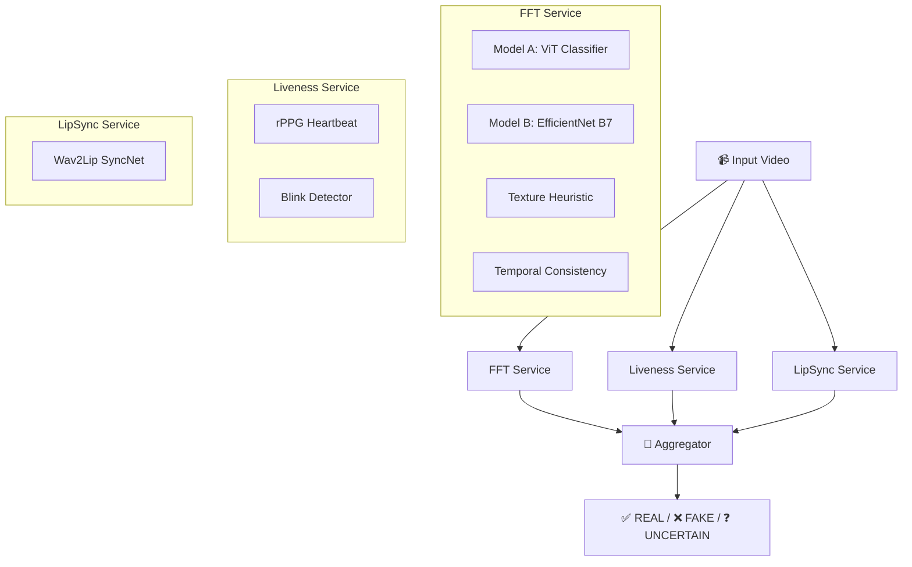

# MAVEN — How Every Model Works (Plain Language)

MAVEN uses **3 microservices** containing **6 models/algorithms** that each look at the video from a different angle. Their scores are then fused by an **Aggregator** into a single **REAL / FAKE / UNCERTAIN** verdict.



---

## 🔬 Service 1 — FFT Service (Pixel-Level Analysis)

This service looks at the **pixels** of the video frames to find visual signs of AI manipulation. It runs **4 sub-models** on the video.

---

### Model A — ViT Deepfake Classifier

| | |
|---|---|
| **What it is** | A pre-trained Vision Transformer (ViT) from HuggingFace |
| **Model ID** | `dima806/deepfake_vs_real_image_detection` (~96% accuracy) |
| **Source** | [analyzer.py](file:///home/batman/Desktop/Maven/ml-services/fft_service/analyzer.py) |

#### How it works — step by step:

1. **Sample frames**: Instead of looking at every frame (which would be slow), MAVEN picks **30 frames evenly spread** across the entire video. For example, in a 300-frame video it picks frame 0, 10, 20, 30, … 290.

2. **Find the face**: For each frame, it uses an **OpenCV Haar Cascade** face detector to locate the largest face. It crops just the face region (with a 15% padding around it). If no face is found, it uses the full frame.

3. **Resize**: The face crop is resized to **256×256 pixels** for consistency.

4. **Classify**: The face image is fed into the **ViT (Vision Transformer)** model. This is a neural network that was trained on thousands of real and fake face images. It outputs a probability: 
   - `0.0` = definitely real  
   - `1.0` = definitely fake

5. **Calibration**: Raw ViT scores have a known bias — even real videos compressed with H.265 (common on phones) get scores around 0.50–0.56. MAVEN fixes this with a **piecewise linear calibration**:
   - Scores in the ambiguous zone `[0, 0.60]` are compressed down toward `[0, 0.45]` (real-leaning)
   - Scores above 0.60 (genuine deepfake signal) are preserved as `[0.45, 1.0]`
   - Example: a real video scoring 0.55 raw → 0.38 calibrated ✅

6. **Extract embedding**: While classifying, the model also outputs a **[CLS] embedding** — a 768-dimensional vector that captures the "identity fingerprint" of the face. This is reused by the Temporal Consistency analyzer (free — no extra computation).

> [!TIP]
> The ViT model is the **primary deepfake detector**. It's the most sensitive at finding AI-generated face textures, unnatural skin smoothing, and GAN artifacts.

---

### Model B — DFDC EfficientNet B7 NS

| | |
|---|---|
| **What it is** | Kaggle DFDC competition-winning model by Selim Seferbekov |
| **Architecture** | EfficientNet B7 with Noisy Student pre-training → binary classifier |
| **Source** | [selimsef_predictor.py](file:///home/batman/Desktop/Maven/ml-services/fft_service/selimsef_predictor.py) |

#### How it works — step by step:

1. **Sample 15 frames** evenly across the video.

2. **Face crop**: Uses the same face-crop function as the ViT model.

3. **Preprocess**: Each face crop is resized to **380×380** using isotropic resize (keeps aspect ratio, pads with black). Then normalized with ImageNet mean/std values.

4. **Batch inference**: All 15 frames are stacked into a single batch and fed through the **EfficientNet B7** CNN in one shot. The network outputs one logit per frame, which is passed through **sigmoid** to get a fake probability per frame.

5. **Aggregate**: The mean of all 15 per-frame probabilities becomes the raw DFDC score.

6. **Calibration**: The raw score is linearly remapped from `[0.15, 1.0]` → `[0.0, 1.0]`. Scores below 0.15 (confidently real) are clamped to 0.

> [!NOTE]
> This model was trained on the **DeepFake Detection Challenge** dataset (Facebook/Meta, 2020) which contains diverse face-swap and face-reenactment deepfakes. It complements the ViT model because it was trained on different data with a completely different architecture (CNN vs Transformer).

---

### Texture Heuristic (Laplacian + Sobel)

| | |
|---|---|
| **What it is** | A hand-crafted image sharpness test — no neural network involved |
| **Source** | [analyzer.py → _compute_texture_fake_score()](file:///home/batman/Desktop/Maven/ml-services/fft_service/analyzer.py#L151-L165) |

#### How it works:

AI-generated faces are often **too smooth** — they lack the fine texture details (pores, hair follicles, skin irregularities) that real skin has. This heuristic measures that:

1. **Laplacian variance**: Applies a Laplacian edge-detection filter to the grayscale face crop. Real faces have high variance (lots of sharp edges); fake faces have low variance (smooth surfaces).
   - Low variance → **more likely fake**

2. **Sobel gradient magnitude**: Applies Sobel X and Y edge filters and measures the average gradient strength. Real faces have stronger gradients.
   - Low gradient → **more likely fake**

3. **Combine**: Final texture score = `0.65 × Laplacian score + 0.35 × Sobel score`

4. **Blend with ViT**: Each frame's final score = `0.85 × ViT score + 0.15 × texture score`. The texture heuristic acts as a sanity check on the ViT model.

> [!TIP]
> This is a simple but effective guard against over-smoothed AI faces. It doesn't need any training data and works instantly.

---

### Temporal Consistency Analyzer

| | |
|---|---|
| **What it is** | Measures how smoothly the face identity changes across frames |
| **Source** | [temporal_analyzer.py](file:///home/batman/Desktop/Maven/ml-services/fft_service/temporal_analyzer.py) |

#### The core idea:

In a **real** video, the person's face changes very smoothly from frame to frame (slight head turns, subtle expressions). In a **deepfake**, the AI regenerates the face independently for each frame, causing tiny identity flickers, texture jumps, and blending artifacts that break the natural temporal flow.

#### How it works:

1. **Reuse ViT embeddings**: During Model A's run, each frame already produced a 768-dimensional [CLS] embedding vector. These are reused here — no extra computation.

2. **Cosine similarity**: For each pair of consecutive frames, compute the cosine similarity between their embeddings. Real videos get values close to 1.0 (very similar). Deepfakes get lower, more erratic values.

3. **Sliding window**: A window of 12 frames slides across the similarity series. For each window:
   - Compute the **mean similarity** (how consistent the identity is)
   - Compute the **standard deviation** (how erratic the changes are)
   - Window score = `mean - 0.30 × std` (penalize erratic windows)

4. **Aggregate**: The overall temporal consistency score is the **mean of all window scores**. The worst window is reported for explainability.

5. **Output**: Score range `[0, 1]` where:
   - `1.0` = perfectly consistent (real)
   - `0.0` = totally inconsistent (fake)

---

### How FFT Service Blends Everything

The final FFT `artifact_score` is a **weighted blend of all 4 signals**:

```
artifact_score = 0.45 × ViT aggregate + 0.30 × DFDC score + 0.25 × Temporal fake probability
```

If the DFDC model isn't available (weights missing), it falls back to:
```
artifact_score = 0.55 × ViT aggregate + 0.45 × Temporal fake probability
```

**Safety override**: If ≥75% of frames are flagged suspicious AND ViT aggregate > 0.75, the artifact_score is floored at 0.70 (FAKE threshold) — this prevents a single weak model from overriding an extremely confident ViT.

---

## 💓 Service 2 — Liveness Service (Biological Signals)

This service checks if the person in the video is **biologically alive** — something deepfakes cannot fake.

---

### rPPG (Remote Photoplethysmography) — Heartbeat Detection

| | |
|---|---|
| **What it is** | Detects your actual heartbeat from tiny skin color changes |
| **Algorithm** | CHROM (De Haan & Jeanne, 2013) |
| **Source** | [rppg.py](file:///home/batman/Desktop/Maven/ml-services/liveness_service/rppg.py) |

#### The science behind it:

Every time your heart beats, blood flows through the capillaries in your skin, causing **microscopic color changes** — invisible to the naked eye but detectable by a camera. This is the same principle used by pulse oximeters on your finger, but applied remotely to the forehead.

Deepfake generators don't model blood flow. So a deepfake video will **not** contain a detectable heartbeat signal.

#### How it works — step by step:

1. **Read every frame** of the video (not sampled — needs continuous data for signal extraction).

2. **Detect face landmarks**: Uses **MediaPipe Face Mesh** (468 landmarks) to find 7 specific forehead points.

3. **Extract forehead ROI**: Creates a convex hull from those 7 points and builds a binary mask. Extracts all pixels inside that forehead region.

4. **Compute mean RGB**: For each frame, computes the average R, G, B values across all forehead pixels. This gives a time series of color values.

5. **CHROM algorithm**: Applies the chrominance-based algorithm:
   ```
   Xs = 3.0×R - 2.0×G
   Ys = 1.5×R + G - 1.5×B
   rPPG = Xs - (σ(Xs) / σ(Ys)) × Ys
   ```
   This cancels out lighting variations and isolates the tiny blood-pulse signal.

6. **Bandpass filter**: A 3rd-order Butterworth filter keeps only frequencies between **0.75–3.0 Hz** (= 45–180 BPM) — the physiological heart rate range.

7. **FFT peak detection**: Runs FFT on the filtered signal to find the **dominant frequency** = the heart rate.
   - Example: dominant frequency 1.2 Hz → heart rate = 72 BPM ✅

8. **Signal quality (SNR)**: Computes signal-to-noise ratio. If SNR is high (strong, clear peak) → high quality → pulse is present.

9. **Output**:
   - `pulse_present`: true if quality > 0.3
   - `estimated_hr_bpm`: e.g., 72.3
   - `signal_quality`: 0.0–1.0 (used as the rPPG liveness score)

> [!IMPORTANT]
> Needs at least **200 frames** (~8 seconds at 25fps) with a visible forehead to work. Very short clips will get a neutral score.

---

### Blink Detector (EAR — Eye Aspect Ratio)

| | |
|---|---|
| **What it is** | Counts eye blinks and checks if the pattern is humanly natural |
| **Algorithm** | EAR (Soukupova & Cech, 2016) |
| **Source** | [blink_detector.py](file:///home/batman/Desktop/Maven/ml-services/liveness_service/blink_detector.py) |

#### The idea:

Humans blink **15–25 times per minute** with a fairly regular rhythm. Many deepfake methods either suppress blinking entirely or produce erratic, unnatural blink patterns.

#### How it works:

1. **Read every frame** and detect face landmarks with MediaPipe Face Mesh.

2. **Compute EAR** for both eyes:
   ```
   EAR = (A + B) / (2 × C)
   ```
   Where:
   - A, B = vertical distances between the upper and lower eyelid
   - C = horizontal distance between eye corners
   
   When the eye is open, EAR is high (~0.3). When it's closed, EAR drops below **0.18**.

3. **Detect blinks**: A blink is counted when EAR stays below 0.18 for at least **3 consecutive frames** (~120ms at 25fps — a real blink lasts 150–400ms).

4. **Compute blink rate**: `blinks ÷ video duration in minutes`

5. **Regularity score**: Uses a **Gaussian function** centered at 17.5 blinks/min:
   ```
   regularity = exp(-(rate - 17.5)² / (2 × 25²))
   ```
   - 17.5/min → score 1.0 (perfect)
   - 0/min or 100/min → score near 0.0 (suspicious)
   - Gracefully degrades at extremes (doesn't cliff to zero)

---

### How Liveness Service Fuses Scores

```
liveness_score = 0.70 × rPPG score + 0.30 × blink score
```

- rPPG gets **70% weight** because a heartbeat is nearly impossible for deepfakes to replicate
- If no pulse is detected, rPPG contributes only 0.15 (strong synthetic indicator)
- **Safety floor**: If rPPG confirms pulse with high quality (>0.8), the liveness score is floored at 0.65 — a strong heartbeat shouldn't be overridden by noisy blink data

---

## 🗣️ Service 3 — LipSync Service (Audio-Visual Sync)

This service checks if the person's **lip movements match what they're saying** — a classic deepfake tell.

---

### Wav2Lip SyncNet (Cross-Modal Transformer)

| | |
|---|---|
| **What it is** | The lip-sync discriminator from Wav2Lip (Prajwal et al., ACM MM 2020) |
| **Architecture** | Dual CNN encoder: face encoder + audio encoder → cosine similarity |
| **Source** | [cross_modal_transformer.py](file:///home/batman/Desktop/Maven/ml-services/lipsync_service/cross_modal_transformer.py) |

#### The idea:

In a real video, the mouth shapes perfectly match the spoken audio. In a deepfake (especially audio-swap or face-swap), the lips and audio go **out of sync** — even by just a few milliseconds, which is detectable.

#### How it works — step by step:

1. **Extract audio**: Uses **ffmpeg** to pull the audio track from the video and convert it to 16kHz mono WAV.

2. **Compute mel spectrogram**: Converts the audio to an **80-band mel spectrogram** (a visual representation of sound frequencies over time). Parameters match the original Wav2Lip training: n_fft=800, hop=200.

3. **Extract lip crops**: For every frame, MediaPipe Face Mesh detects 30 **outer lip landmarks**. A bounding box is drawn around the lips with 10px padding, and the lip region is cropped and resized to **96×96 pixels**.

4. **Sliding window scoring**: A window of **5 consecutive frames** slides across the video (1 frame at a time):
   
   - **Video input**: 5 lip crops → only the **bottom half** of each crop is used (just the mouth area) → stacked on the channel dimension → tensor of shape `(1, 15, 48, 96)`
   
   - **Audio input**: The corresponding mel spectrogram slice is resized to `(80, 16)` → tensor of shape `(1, 1, 80, 16)`
   
   - **Skip silent windows**: If the audio RMS energy is below 0.01, the window is skipped — silence is not evidence of a deepfake.

5. **SyncNet inference**: Both tensors are fed through the **SyncNet** model:
   - The **face encoder** (17-layer CNN) compresses the lip video into a 512-dim vector
   - The **audio encoder** (14-layer CNN) compresses the audio into a 512-dim vector
   - Both vectors are **L2-normalized**, then their **cosine similarity** is computed
   - Passed through sigmoid → score between 0 and 1
   - High score = **in sync** (real)
   - Low score = **out of sync** (fake)

6. **Flag bad windows**: Any window with score < 0.4 is flagged as potentially out-of-sync.

7. **Merge segments**: Adjacent flagged windows (gap < 0.5 seconds) are merged into contiguous "suspicious segments".

8. **Final verdict**:
   - Mean score < 0.35 → `OUT_OF_SYNC` (likely deepfake)
   - Mean score 0.35–0.50 → `UNCERTAIN`
   - Mean score > 0.50 → `IN_SYNC` (likely real)

> [!NOTE]
> This model requires the `lipsync_expert.pth` weights file (~200MB) from the Wav2Lip repository. Without it, the service runs with random weights and its scores are unreliable — the aggregator detects this and reduces its weight to 0.

---

## 🧠 The Aggregator — Final Verdict

The **aggregator** ([aggregator.js](file:///home/batman/Desktop/Maven/backend/src/services/aggregator.js)) fuses all 3 service results into a single verdict.

### Step 1: Unify to "Fake Probability" Scale

All scores are converted to a unified scale where **0 = REAL, 1 = FAKE**:

| Signal | Conversion |
|--------|-----------|
| FFT `artifact_score` | Used directly (already 0=real, 1=fake) |
| Liveness `liveness_score` | `1 - liveness_score` (flip: high liveness = low fake prob) |
| LipSync `sync_score` | `1 - sync_score` (flip: high sync = low fake prob) |
| Temporal `consistency_score` | `1 - consistency_score` (flip) |

### Step 2: Dynamic Weights

Weights depend on what data is available:

| Condition | FFT | Liveness | LipSync | Temporal |
|-----------|-----|----------|---------|----------|
| LipSync weights missing | 0.80 | 0.20 | 0.00 | 0.00 |
| LipSync UNCERTAIN | 0.60 | 0.10 | 0.30 | 0.00 |
| Normal (no temporal) | 0.55 | 0.10 | 0.35 | 0.00 |
| Normal (with temporal) | 0.45 | 0.05 | 0.35 | 0.15 |

### Step 3: Compute Weighted Score + Boosts

```
finalFakeProb = fft×W1 + liveness×W2 + lipsync×W3 + temporal×W4
```

Plus these boost adjustments:
- **FFT uncertain + LipSync uncertain** → +0.06 nudge toward fake
- **95%+ suspicious frames** → +0.08 nudge toward fake
- **Severe temporal inconsistency** (score < 0.4) → +0.05 nudge toward fake

### Step 4: Verdict Thresholds

| Final Fake Probability | Verdict |
|------------------------|---------|
| < 0.46 | ✅ **REAL** |
| 0.46 – 0.55 | ❓ **UNCERTAIN** |
| > 0.55 | ❌ **FAKE** |

### Step 5: Hard Overrides

These catch extreme cases:

- **Strong FAKE**: If FFT > 0.65 AND LipSync > 0.55 → force **FAKE** regardless
- **Strong REAL**: If FFT < 0.3 AND Liveness < 0.2 AND LipSync < 0.6 → force **REAL** regardless

---

## Summary Table

| # | Model | Service | What It Detects | Type |
|---|-------|---------|----------------|------|
| 1 | ViT Deepfake Classifier | FFT | AI-generated face textures and GAN artifacts | Neural Network (Transformer) |
| 2 | EfficientNet B7 NS | FFT | Face-swap and face-reenactment manipulation | Neural Network (CNN) |
| 3 | Laplacian + Sobel | FFT | Over-smoothed, textureless AI skin | Hand-crafted heuristic |
| 4 | Temporal Consistency | FFT | Frame-to-frame identity flicker | Embedding cosine similarity |
| 5 | rPPG (CHROM) | Liveness | Presence/absence of heartbeat | Signal processing (no NN) |
| 6 | EAR Blink Detector | Liveness | Unnatural or absent blink patterns | Geometric calculation |
| 7 | Wav2Lip SyncNet | LipSync | Audio-visual lip sync mismatch | Neural Network (dual CNN) |
